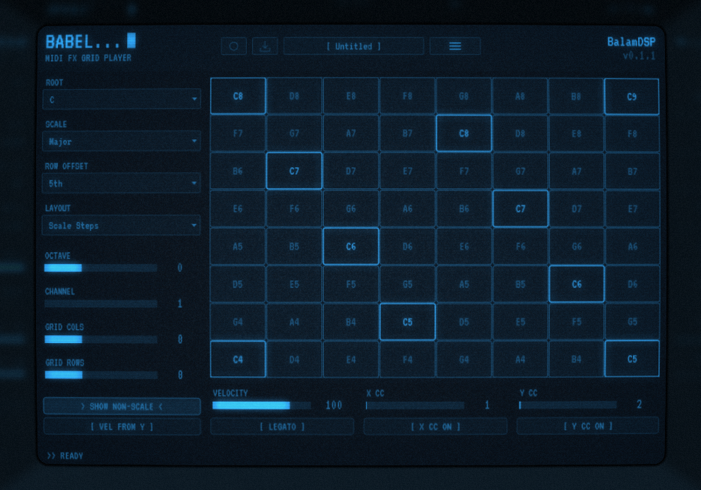

# Babel — MIDI FX Grid Player

A MIDI grid controller by **BalamDSP**. Touch the pad to trigger
quantized MIDI notes — X walks the scale, rows stack by a configurable
interval. Just route its MIDI output to any instrument.

Formats: **VST3**, **AU** (macOS), **CLAP** + **Standalone** (JUCE 9, CMake).

<p align="center">
  
</p>

## Features

### Grid & quantize
- Playable X/Y grid (**4–16 x 4–16** pads, default 8x8).
- Two layouts: **Scale Steps** (every pad in-key) and **Chromatic** (semitones).
- Quantize to **22** scales with root-note dropdown and octave shift.
- Row offset: **3rd / 4th / 5th / 6th / 7th / octave**.
- Show/hide non-scale notes (chromatic layout).
- Note readout in the status bar as you play.

### Play
- **Velocity** control with optional Y-position scaling (low rows softer).
- **Legato** glide mode for overlapping notes.
- MIDI channel select (1–16).
- Assignable **X / Y MIDI CC** outputs — including continuous CCs while
  sliding across the same pad.

### Record & export takes
- Host-locked MIDI takes via **REC**: arm it, press play in your DAW, and
  everything you trigger is stamped against the host timeline
  (tempo + time signature captured).
- **Click EXPORT** to save a timestamped `Babel-take-<date>.mid` file, or
  **drag the EXPORT button** straight into your DAW / file manager.

### Presets
- `.babel` preset system with subfolder menus in the top-bar display.
- **Init / Save / Save As... / Load From File...** from the menu.
- Custom preset folder (or reset to default).

### Interface
- Terminal panel with a toggleable **CRT overlay** based on cool-retro-term
  (Low / Medium / High strength).
- **UI zoom**: 75 % / 100 % / 125 % / 150 % / 200 % / 300 %.

## Building

Requirements: CMake ≥ 3.22 and a C++17 compiler. JUCE 9.0.1 is fetched
automatically via CMake's FetchContent, and the CLAP wrapper
(`clap-juce-extensions`) is included as a git submodule.

1. Check out the repository with submodules:

   ```sh
   git clone --recurse-submodules <url>
   # or, if already cloned:
   git submodule update --init --recursive
   ```

2. Configure and build:

   ```sh
   cmake -B build
   cmake --build build --config Release
   ```

3. Artifacts land in `build/Babel_artefacts/Release/`:
   - `VST3/Babel.vst3`
   - `CLAP/Babel.clap`
   - `Standalone/Babel`

   When `BABEL_COPY_AFTER_BUILD` is ON (the default) plugins are also
   copied into the platform's default system plugin folders
   (`~/.vst3` / `~/.clap`).

## Third-party

| Component | Author | License |
|---|---|---|
| JUCE framework | JUCE Ltd | AGPLv3 |
| clap-juce-extensions (CLAP wrapper) | [free-audio](https://github.com/free-audio/clap-juce-extensions) | MIT |
| cool-retro-term (CRT effect) | Filippo Scognamiglio (Swordfish90) | GPL |
| VT323 typeface | Peter Hull | OFL |

## License

Babel — Copyright (C) 2026 BalamDSP

This program is free software: you can redistribute it and/or modify it under
the terms of the GNU Affero General Public License as published by the Free
Software Foundation, either version 3 of the License, or (at your option) any
later version.

This program is distributed in the hope that it will be useful, but WITHOUT
ANY WARRANTY; without even the implied warranty of MERCHANTABILITY or FITNESS
FOR A PARTICULAR PURPOSE. See the GNU Affero General Public License for more
details. The full text is in [LICENSE](LICENSE) and at
<https://www.gnu.org/licenses/>.

Third-party components remain under their own licenses (table above).
